# portfolio

I am frequently asked for a portfolio. With more than 45 years at the keyboard, putting one together is no small feat! Not to mention how NDAs complicate things.

But, finally, I have started one, going all the way back to the 1980s.

Many of these projects are screenshots, or replicas from memory, but hopefully even those will give you an idea of my journey through software engineering.

## Highlights 

## Catalog

### Comet Simulator (1984)

* **Title:** Comet Simulator
* **Date:** 1984
* **Language:** BBC (Micro) BASIC
* **Project:** For fun

As an armchair physicist and full-on computer programmer, it was natural (for me at least) to combine the two. This particular project was for fun, and it followed my learning of two important astronomy concepts: Newton's universal law of gravitation (the force of gravity is proportional to the product of the masses and inversely proportional to the distance between them) and the knowledge that a comet's tail always points away from the sun.

Up until then I thought that a comet, as the Bayeux tapestry depicts, had a tail that streams out behind it like a contrail. In fact it's more like a steam ship, where the smoke from the smokestack follows the wind. A comet's tail always follows the solar wind, which means it points away from the Sun, regardless of the comet's direction of travel.

The original required careful attention to performance. For example, I had to carefully erase only the comet and its tail—as a full screen redraw was far too slow. In this version I just wipe the canvas and start over!

I have re-created it here in JavaScript using jQuery and an HTML5 canvas—so as usual the code looks nothing like the original. I also recall a few more settings on the original, but can't remember exactly what they were. Nevertheless, this will give you an idea.

All Javascript (with JQuery) - no GPU.

* [Proceed to simulator](accretion/accretion.html)

### 3D Maze (1986)

* **Title:** 3D Maze
* **Date:** 1986
* **Language:** Atari BASIC, 6502 Machine Code
* **Project:** For fun

In my quest to conquer the world of the 3D, inspired by Bell and Braben's [Elite™](http://en.wikipedia.org/wiki/Elite_%28video_game%29), I created several 3D "worlds", including this maze. Too rudimentary to be called games, they focused on 3D rendering.

I'd recently created a wireframe "mountain" scape similar to [*Battlezone™*](http://en.wikipedia.org/wiki/Battlezone_%281980_video_game%29) and observed that it didn't take a lot of detail to bring smoothness of scrolling to a halt.

I wanted to push the limits, so I created this 3D "maze"—the maze was auto-generated and there were no enemies.

Bit-blitting and tweening were terminology that I wouldn't hear until decades later. Nevertheless, this simulation used machine code to "blit" wall shapes from offscreen RAM onscreen to create the effect of smooth movement between fixed nodes in the maze.

To give you an idea of what this was like, I have included an image of the Sinclair ZX81's *Monster Maze*, almost certainly a subconscious inspiration. My graphics and animation were considerably smoother, but then again I had better hardware by a generation. *Monster Maze* was limited to special characters that extended the ASCII set, whereas I had access to pixels and more than twice the display resolution.

Eventually, I hope to find the time to re-create this in HTML5 where it will almost certainly run smoothly without resorting to anything like machine language—and probably 0.1% of the code size!

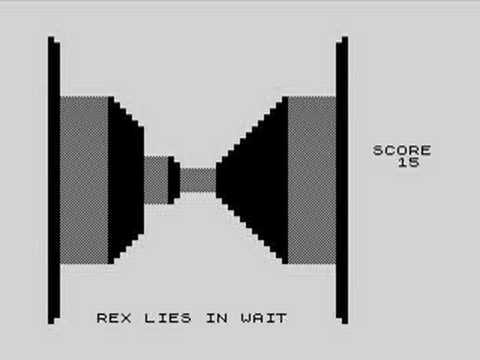

### Battleships (1987)

- **Title:** Battleships  
- **Date:** 1987  
- **Language:** Atari BASIC  
- **Project:** For fun  

This game was inspired by the traditional paper-and-pencil grid-based game.

The original code is long lost, so I have re-created it here in HTML5. Unfortunately, I got a little carried away. The original could not, of course, be played by two players across the internet—there *was* no internet (at least not available to the public at large). In my original game, each player had to step away from the computer when it was not their turn.

Feel free to play this game, but remain within shouting distance of your opponent. This is because of two significant shortcomings (sorry, ran out of time!):  
1. There is no notification of when a ship is completely sunk  
2. There is no notification of a winner  

* [Play Battleships](./battleships/battleship.html)

### Meteoriot (1985)

**Title:** Meteoriot Lander Game  
**Date:** 1985  
**Language:** Atari BASIC  
**Project:** For Fun

Although my day job is business applications, I've always maintained that games and simulations push the language and hardware to their limits. While this game did not push the Atari 800XL to its limits, it was a significant step in that direction for me as a developer, as well as a grounding in applied gravity, inertia and momentum.

After each successful landing there would be more rocks, and more rugged terrain. After about level 20 or so, the game became impossible to play, although in my defence it was fun and challenging up until that point.

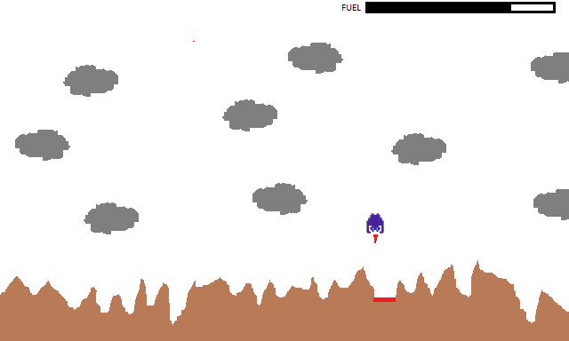

### Database Designer (1983)

**Title:** Universal Multipurpose Database Designer  
**Date:** Jan–May 1983  
**Language:** Research Machines BASIC  
**Project:** High School Graduation, Computer Science

Although I say so myself, somewhat ahead of its time (see [this article](http://www.ustudy.in/node/4091)), although not entirely relational by today's popular understanding of the term.

It is widely believed that the term *relational* database refers to the relationships between tables (entity relationships). Technically speaking, however, it refers to the fact that each datum in a *row* within the table are related: a concept known as a *record*. My database design program had tables, and therefore records, but it had no concept of *entity relationships*. It did support multiple tables within a single database. Ted Codd's pioneering relational work was more than a decade into its evolution, but his concepts were not widely understood.

My original program has long since been lost. Even if it hadn't, I would have no 380Z on which to run it. Here I've approximated a few screens using a DOS batch file. Memory is a funny thing, so I don't guarantee it matches the original, but at least it gives an idea.

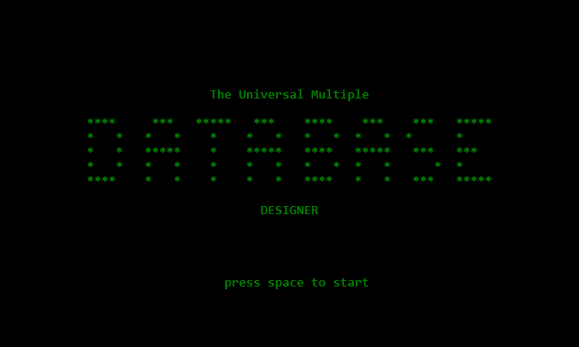  
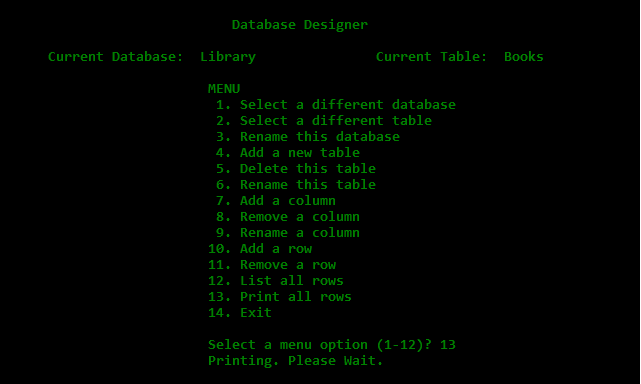  
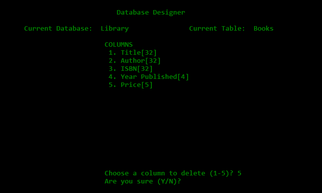

### Pub POS and Stock Manager (1983)

**Title:** Public House – Stock Management and Point of Sale  
**Date:** Jan–May 1983  
**Language:** Research Machines BASIC  
**Project:** High School Graduation, Computer Science

Top marks for this project, although it was by far the easiest of my three capstones. All I had to do was examine a few forms and receipts from my parents' public house and build a database around them. I suspect the evaluators did not dig into the code too far or my Monopoly game would have come out first.

In addition to being the easiest of my three graduation projects, it was also the least fun to write: no room for creativity—just replicate a paper-based business workflow in code. On the other hand, no public house "landlord" (as they are referred to) would have, in those days, replaced a perfectly good cash register and account books with a several-thousand dollar 380Z, so this was strictly an exercise in what was possible, rather than what was practical.

The original program and data have long since been lost. Even if they hadn't, I would have no 380Z on which to run it. Here, I've simulated several screens with a DOS batch file. Memory is a funny thing, so I don't guarantee it matches the original, but at least it gives an idea.

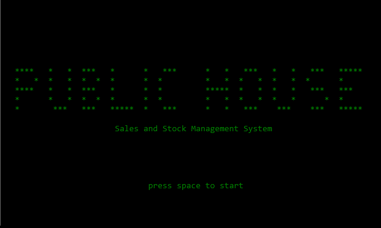  
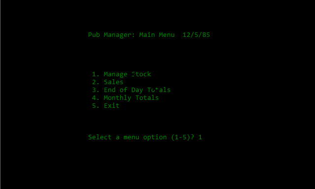  
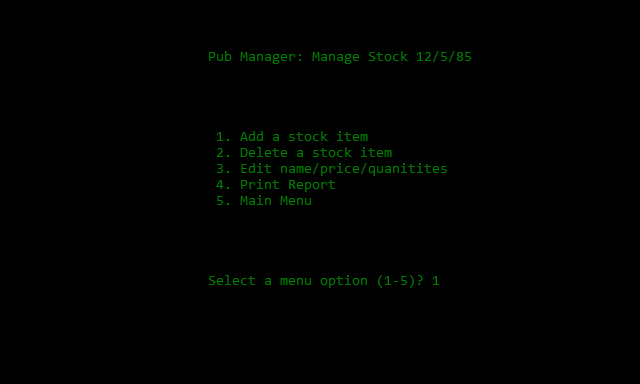  
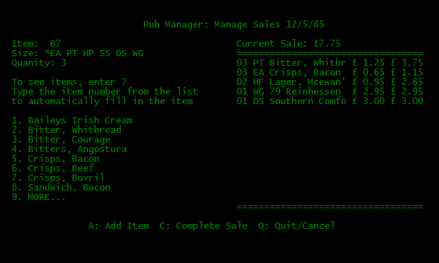

### Monopoly - Adventure Game Style (1983)

**Title:** Monopoly – The Adventure  
**Date:** Jan–May 1983  
**Language:** Research Machines BASIC  
**Project:** High School Graduation, Computer Science

My only "grade B" project! I was informed ahead of time that the games usually received lower grades compared to applications, but I have never believed that bureaucracy should stand in the way of an interesting project.

Games have, for a long time, pushed the limits of computing more than business applications: whether UI, memory, rules, storage, or bandwidth—this is axiomatic. So my purpose here was to push as many of those limits as my somewhat narrow experience allowed. The 380Z had only the most rudimentary graphics capability, and really required machine code programming to use it well. While I knew my way around the Z80A processor, the project specification was a BASIC program. Hence, my "text-based adventure" approach to the game.

My goal was to handle a large amount of data in a relatively small amount of RAM: 16k for the program, data, and graphics. Not a lot for a Monopoly game, which has 40 spaces, Chance cards, Community Chest cards, and a large number of rules and messages. It took several attempts to get this to fit into available RAM!

Of course, by today's standards, techniques, and technologies, it is simplistic. Nevertheless, it was one of my first ever projects, and was a lot of fun to create.

The original program and data have long since been lost. Even if they hadn't, I would have no 380Z on which to run it and no time to re-create the whole thing. Here, I've simulated several screens with a DOS batch file. Memory is a funny thing, so I don't guarantee it matches the original, but at least it gives an idea.

*By the way, if you don't recognize the street names, bear in mind it was the British Edition. Streets and Stations are based on real places in the City of London.*

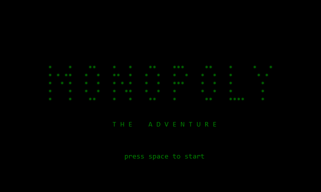  
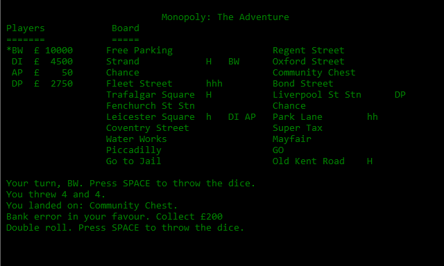  
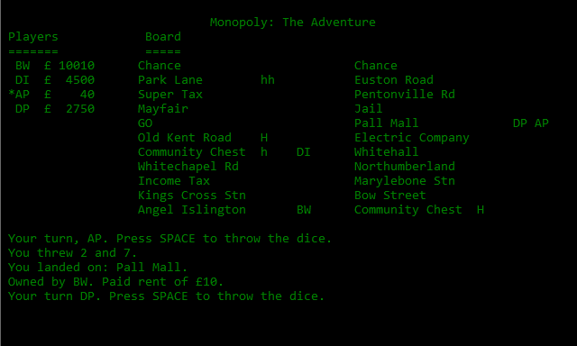

### Caves of Chaos (1981)

**Title:** Caves of Chaos  
**Date:** 1981  
**Language:** Research Machines BASIC.  
**Project:** For fun

In the early days, there were few, if any, graphical games. Adventure games, such as [Colossal Cave](http://en.wikipedia.org/wiki/Colossal_Cave_Adventure) were more common.

I wanted to see if I could do something like that as my first ever programming project. Of course, I didn't have a mainframe available to store all that text and data. So I used a pseudo-random number generator to come up with a maze and treasures. These could be generated from minimal data during game initialization, yet have sufficient variety to simulate a large, pre-defined game environment.  
There is very little command processing: you can't look, or drop, or use anything. Nor is there any endpoint. But, hey, it was my first project.

It was fun to write, and (by the standards of the day) fun to play for, oh, at least 5 minutes.

I have re-created it here in JavaScript using JQuery and a game Object — so the code looks nothing like the original (and I doubt the gameplay is close either, after 31 years). Nevertheless, if you are really nostalgic for text-based adventure games, or have been in cryogenic suspension for the last 3 decades you can play it. I have set it up to use the query parameter `?maze` as the seed, so you can play multiple games. And, yes, I have taken a few shortcuts in the re-creation.

As many JavaScript developers will realize, there is no native capability to create pseudo-random numbers. Hence I have borrowed David Bau's excellent script, which can be found here:  
[http://davidbau.com/encode/seedrandom.js](http://davidbau.com/encode/seedrandom.js)

- [Caves of Chaos (default game)](./cavs/caves.html)  
- [Caves of Chaos (different seed)](./caves/caves.html?maze=another)

